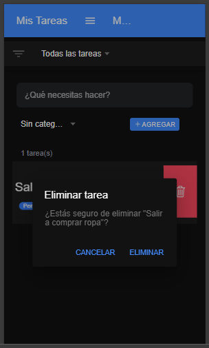
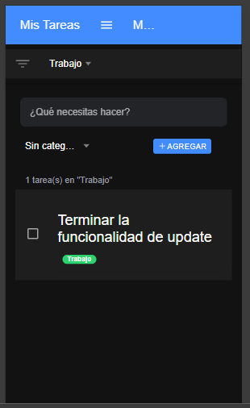
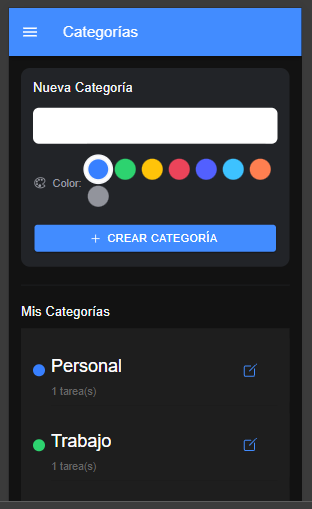
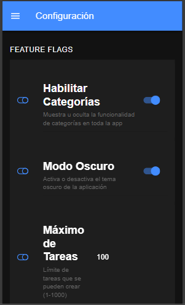

# Todo App - Ionic Angular

Aplicación de lista de tareas (To-Do List) desarrollada con Ionic y Angular para la prueba técnica de Accenture.

---

## Características

- **Agregar tareas** - Crear nuevas tareas con nombre y descripción
- **Marcar como completadas** - Toggle para marcar/desmarcar tareas
- **Eliminar tareas** - Deslizar para eliminar o botón de borrar
- **Categorías** - Crear, editar y eliminar categorías
- **Asignar categorías** - Cada tarea puede tener una categoría
- **Filtrar por categoría** - Ver tareas de una categoría específica
- **Almacenamiento local** - Las tareas se guardan en el dispositivo
- **Firebase Remote Config** - Feature flags para activar/desactivar funciones

---

## Instalación y Ejecución

### Requisitos previos
- Node.js (versión 18 o superior)
- npm (viene con Node.js)
- Ionic CLI

### Paso 1: Instalar Ionic CLI
```bash
npm install -g @ionic/cli
```

### Paso 2: Instalar dependencias
```bash
cd todo-app && npm install
```

### Paso 3: Ejecutar en el navegador
```bash
ionic serve || npx ng serve --port 8100 --open
```
La aplicación se abrirá en `http://localhost:8100`

## Configuración de Firebase

### Paso 1: Crear proyecto en Firebase
1. Ve a [Firebase Console](https://console.firebase.google.com/)
2. Crea un nuevo proyecto
3. Ve a la sesion de Ejecucion - Remote config
4. Habilita Remote Config

### Paso 2: Configurar Remote Config
En Firebase Console > Remote Config, crear los siguientes parámetros:

| Parámetro | Valor por defecto | Descripción |
|-----------|-------------------|-------------|
| `enable_categories` | `true` | Habilita/deshabilita las categorías |
| `enable_dark_mode` | `false` | Habilita/deshabilita modo oscuro |
| `max_tasks` | `100` | Número máximo de tareas |

### Paso 3: Agregar configuración
Copia la configuración de Firebase en `src/environments/environment.ts`


## Funcionalidades de Feature Flags

La aplicación usa Firebase Remote Config para controlar funcionalidades:

### `enable_categories` (boolean)
- **true**: Muestra el botón de categorías y permite filtrar
- **false**: Oculta toda la funcionalidad de categorías

### Cómo probar:
1. Abre Firebase Console > Remote Config
2. Cambia el valor de `enable_categories` a `false`
3. Publica los cambios
4. Reinicia la app y verás que las categorías desaparecen

---

## Optimizaciones de Rendimiento

1. **Lazy Loading**: Las páginas se cargan bajo demanda
2. **Virtual Scroll**: Para listas grandes de tareas
3. **TrackBy**: En *ngFor para optimizar renderizado
4. **OnPush Strategy**: Change detection optimizado
5. **Almacenamiento eficiente**: Uso de Ionic Storage con IndexedDB

---

## Pruebas de funcionalidad

## Agregar tareas


### Tarea marcada como completada


### Eliminar tarea


### Filtro de tareas por categorias 



## Categorias

### Agregar nueva categoria


## Configuracion de feacture flags



## Respuestas a Preguntas

### ¿Cuáles fueron los principales desafíos?
- Configurar Firebase Remote Config con Ionic/Capacitor
- Manejar el almacenamiento local de forma eficiente
- Implementar el filtrado de categorías manteniendo el estado

### ¿Qué técnicas de optimización aplicaste?
- Lazy loading para reducir el bundle inicial
- Virtual scroll para manejar muchas tareas
- Uso de trackBy en listas
- Almacenamiento con IndexedDB (más rápido que localStorage)

### ¿Cómo aseguraste la calidad del código?
- Separación de responsabilidades (servicios, componentes)
- Tipado estricto con TypeScript

---

## Desarrollador

Cristian Mosquera Mosquera 

- LinkedIn: [Ver mi perfil](https://www.linkedin.com/in/cristian-mosquera-mosquera/)

